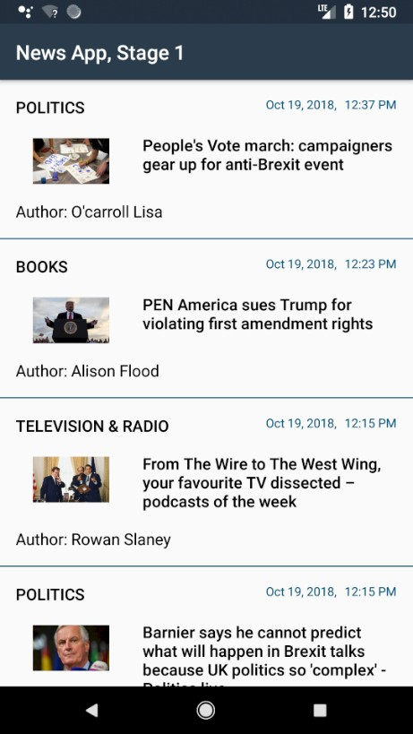

# News App Stage 1

Project #6 for Android Basics by Google Nanodegree Program

<h3>Layout</h3>
<table>
  <tr>
    <th>Criteria</th>
    <th>Meets Specifications</th>
  </tr>
  <tbody>
    <tr>
      <td>
        
Main Screen

      </td>
      <td>
        
App contains a main screen which displays multiple news stories

      </td>
    </tr>
    <tr>
      <td>
        
List Item Contents

      </td>
      <td>
        
Each list item on the main screen displays relevant text and information about the story.

        
The title of the article and the name of the section that it belongs to are required field.

        
If available, author name and date published should be included. Please note not all responses will contain these pieces of data, but it is required to include them if they are present.

        
Images are not required.

      </td>
    </tr>
    <tr>
      <td>
        
Layout Best Practices

      </td>
      <td>
        
The code adheres to all of the following best practices:

        <ul>
          <li>Text sizes are defined in sp</li>
          <li>Lengths are defined in dp</li>
          <li>Padding and margin is used appropriately, such that the views are not crammed up against each other.</li>
        </ul>
      </td>
    </tr>
  </tbody>
</table>

<h3>Funtionality</h3>
<table>
  <tr>
    <th>Criteria</th>
    <th>Meets Specifications</th>
  </tr>
  <tbody>
    <tr>
      <td>
        
Main Screen Updates

      </td>
      <td>
        
Stories shown on the main screen update properly whenever new news data is fetched from the API.

      </td>
    </tr>
    <tr>
      <td>
        
Errors

      </td>
      <td>
        
The code runs without errors.

      </td>
    </tr>
    <tr>
      <td>
        
Story Intents

      </td>
      <td>
        
Clicking on a story uses an intent to open the story in the user’s browser.

      </td>
    </tr>
    <tr>
      <td>
        
API Query

      </td>
      <td>
        
App queries the content.guardianapis.com api to fetch news stories related to the topic chosen by the student, using either the ‘test’ api key or the student’s key.

      </td>
    </tr>
    <tr>
      <td>
        
JSON Parsing

      </td>
      <td>
        
The JSON response is parsed correctly, and relevant information is stored in the app.

      </td>
    </tr>
    <tr>
      <td>
        
No Data Message

      </td>
      <td>
        
When there is no data to display, the app shows a default TextView that informs the user how to populate the list.

      </td>
    </tr>
    <tr>
      <td>
        
Response Validation

      </td>
      <td>
        
The app checks whether the device is connected to the internet and responds appropriately. The result of the request is validated to account for a bad server response or lack of server response.

      </td>
    </tr>
    <tr>
      <td>
        
Use of Loaders

      </td>
      <td>
        
Networking operations are done using a Loader rather than an AsyncTask.

      </td>
    </tr>
    <tr>
      <td>
        
External Libraries and Packages

      </td>
      <td>
        
The intent of this project is to give you practice writing raw Java code using the necessary classes provided by the Android framework; therefore, the use of external libraries for the core functionality will not be permitted to complete this project.

      </td>
    </tr>
  </tbody>
</table>

<h3>Code Readability</h3>
<table>
  <tr>
    <th>Criteria</th>
    <th>Meets Specifications</th>
  </tr>
  <tbody>
    <tr>
      <td>
        
Readability

      </td>
      <td>
        
Code is easily readable such that a fellow programmer can understand the purpose of the app.

      </td>
    </tr>
    <tr>
      <td>
        
Naming Conventions

      </td>
      <td>
        
All variables, methods, and resource IDs are descriptively named such that another developer reading the code can easily understand their function.

      </td>
    </tr>
    <tr>
      <td>
        
Formatting

      </td>
      <td>
        
The code is properly formatted i.e. there are no unnecessary blank lines; there are no unused variables or methods; there is no commented out code.

      </td>
    </tr>
  </tbody>
</table>

<em>Requirements copied from: <a href="http://udacity.com">udacity.com</a>.</em>

 

 
  

